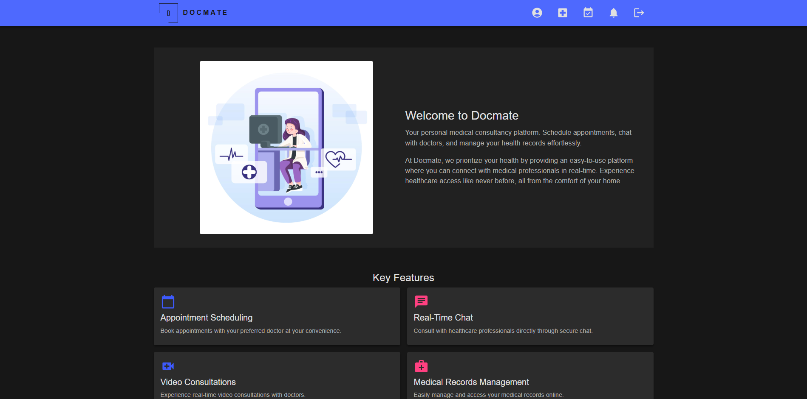
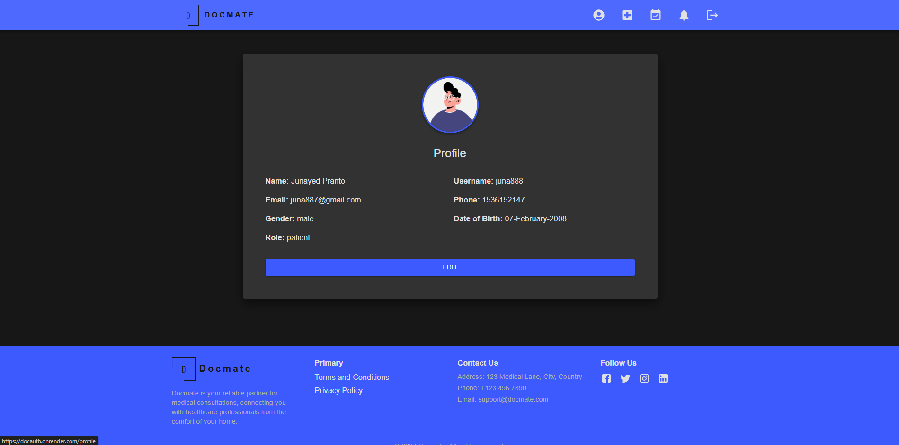
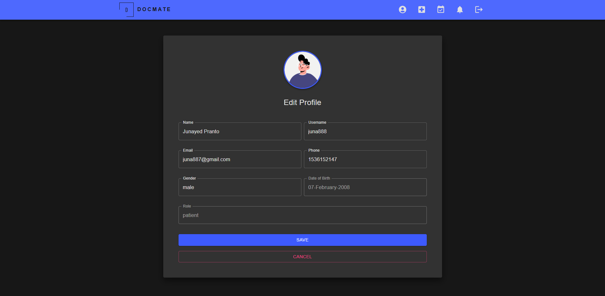
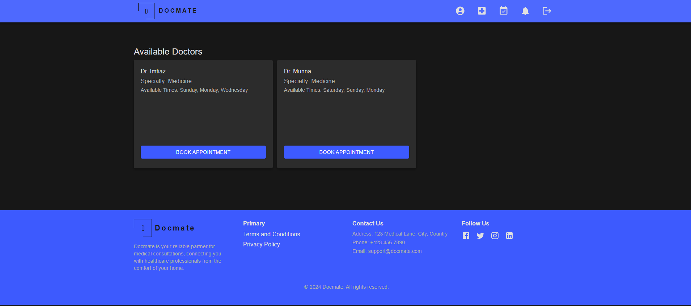
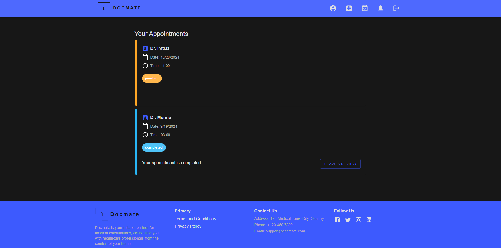
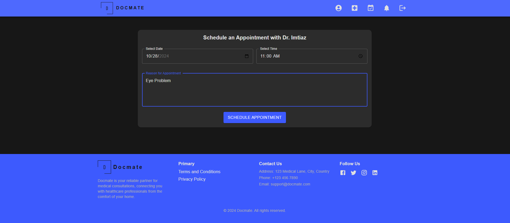
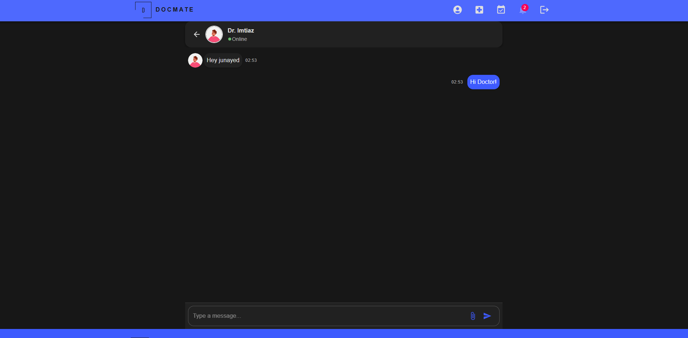
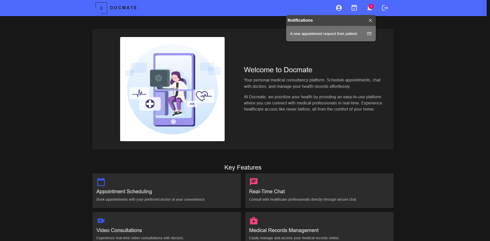
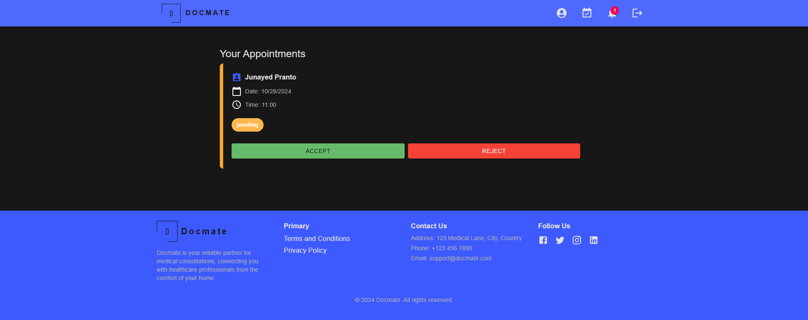

# Docmate Medical Consultancy Platform

Docmate is a full-stack medical consultancy platform developed with the MERN stack. It provides an efficient way for doctors and patients to manage consultations, communicate, and receive notifications, all within a single frontend interface with role-based routes.

## Features

- **Patient Portal:**

  - Simple, user-friendly interface for booking consultations.
  - Appointment management with upcoming and past appointment views.
  - Profile management.
  - Real-time chat with doctors.
  - Notifications for appointment reminders and updates.
  - Secure login and registration.

- **Doctor Dashboard:**

  - Manage patient appointments and availability.
  - Access to real-time chat with patients.
  - Profile management.
  - Notifications for new appointments and patient messages.

- **Role-Based Routing:**

  - Separate routes within the same frontend for doctors and patients, ensuring tailored access.

- **Real-Time Communication:**

  - Integrated chat feature to facilitate real-time communication between patients and doctors.

- **Notifications:**
  - Timely notifications for appointment reminders, status updates, and messages.

## Tech Stack

- **Frontend:** React, MUI
- **Backend:** Node.js, Express.js
- **Database:** MongoDB
- **Authentication:** JWT for secure role-based access
- **Real-Time Features:** Socket.io for chat and notifications
- **Deployment:** Render

## Installation

1. Clone the repository:

   ```bash
   git clone https://github.com/your-username/docmate.git
   ```

2. Install dependencies for the frontend:

   ```bash
   cd frontend
   npm install
   ```

3. Install dependencies for the backend:

   ```bash
   cd backend
   npm install
   ```

4. Create a `.env` file in the backend directory and add the following:

   ```
   MONGO_DB_URI=<Your MongoDB URI>
   JWT_SECRET=<Your JWT Secret>
   PORT=<Your backend port>
   NODE_ENV=<Your node environment>
   ```

5. Run both frontend and backend:
   ```bash
   npm run dev
   ```

## Screenshots

### Patient Portal










### Doctor Dashboard




## Contributing

Contributions are welcome! Feel free to open issues or submit pull requests to improve the Docmate platform.
